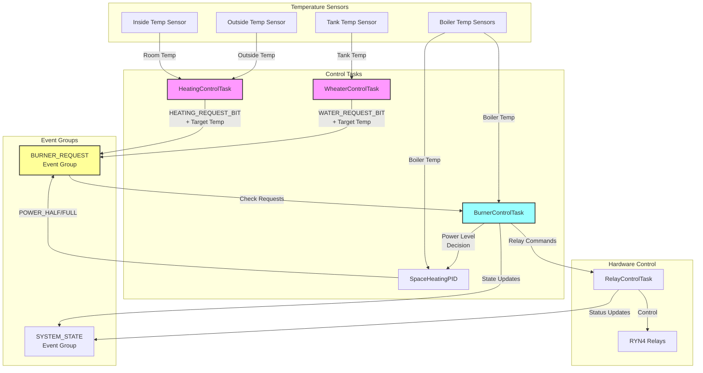
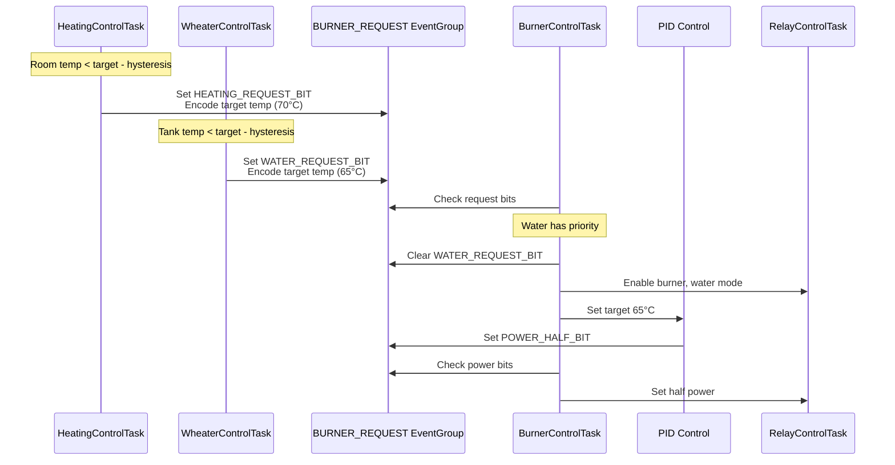
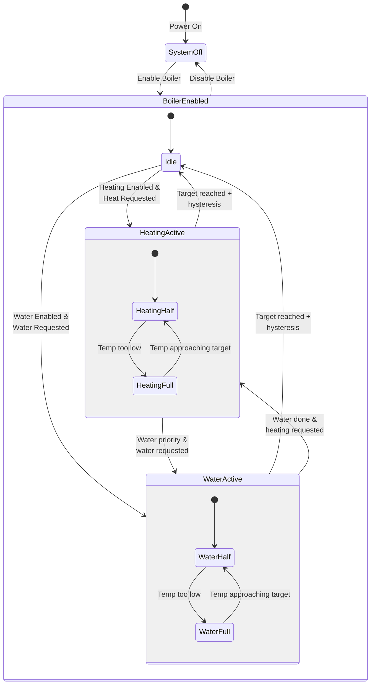
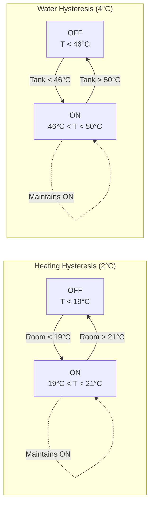
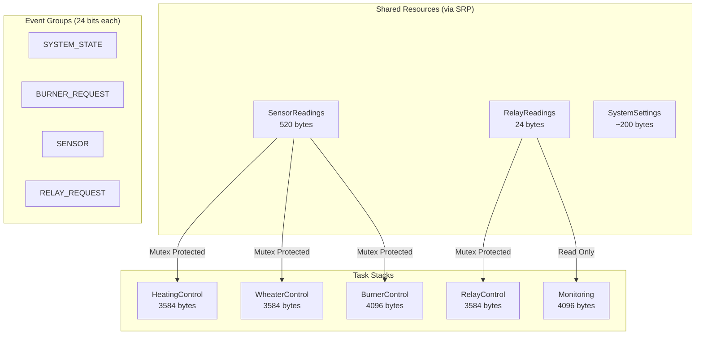
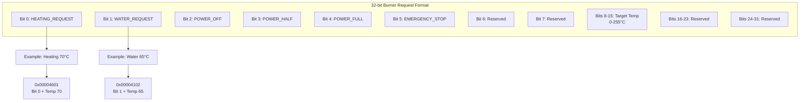
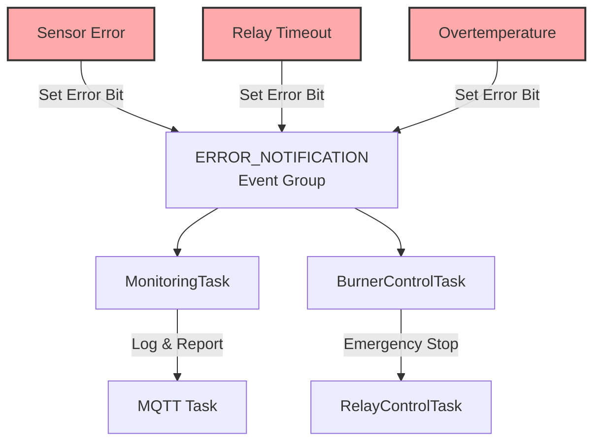

# System Architecture Diagrams

## Control Logic Flow Diagram

## Burner Request Communication

## State Hierarchy

## Hysteresis Implementation

## Task Timing and Priorities

```mermaid
gantt
    title Task Execution Timeline
    dateFormat X
    axisFormat %s
    
    section Control Tasks
    HeatingControlTask (1s)  :active, hct, 0, 1
    WheaterControlTask (1s)  :active, wct, 0, 1
    BurnerControlTask (200ms):crit, bct, 0, 0.2
    
    section PID Control
    SpaceHeatingPID (5s)     :active, pid, 0, 5
    
    section Monitoring
    MonitoringTask (30s)     :mon, 0, 30
    MB8ARTStatusTask (5s)    :mb8, 0, 5
    
    section Relay Control
    RelayControlTask (cont)  :crit, rct, 0, 30
```

## Memory Architecture

## BurnerRequestBits Encoding

## Error Handling Flow

